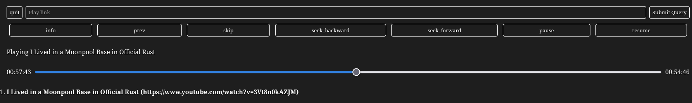

# Friends Queue

A python web server that uses [libmpv](https://github.com/jaseg/python-mpv) to spawn a media player
(even in TTY) and control it.

## Features

- yt-dlp (play videos from basically any site that isn't completely DRMed e.g. youtube)
- Skip forward/back in queue
- 10 second quick seek
- Pause/resume
- Seek bar

## Screenshot

## LICENSE

[AGPLv3.0](./LICENSE)
